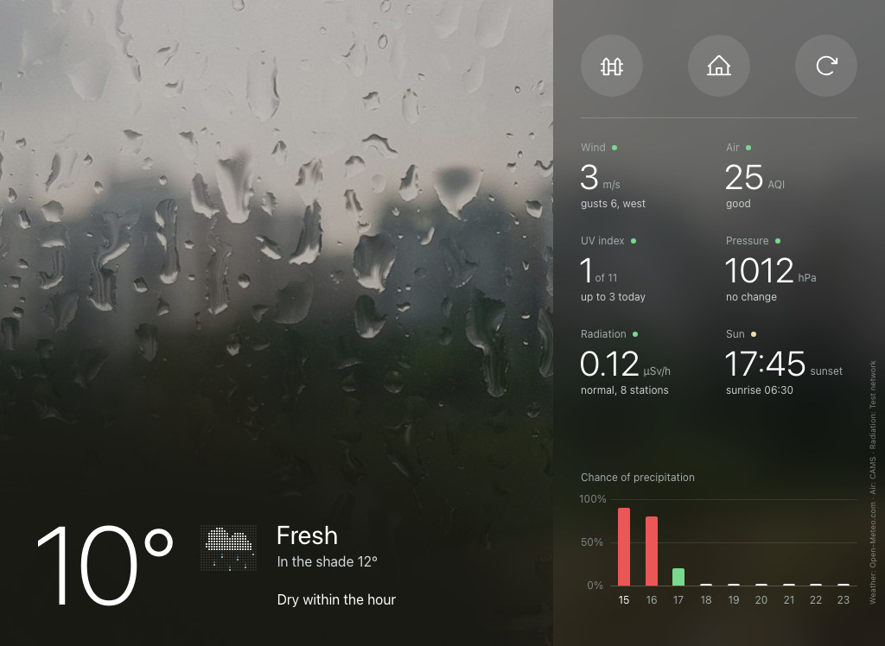
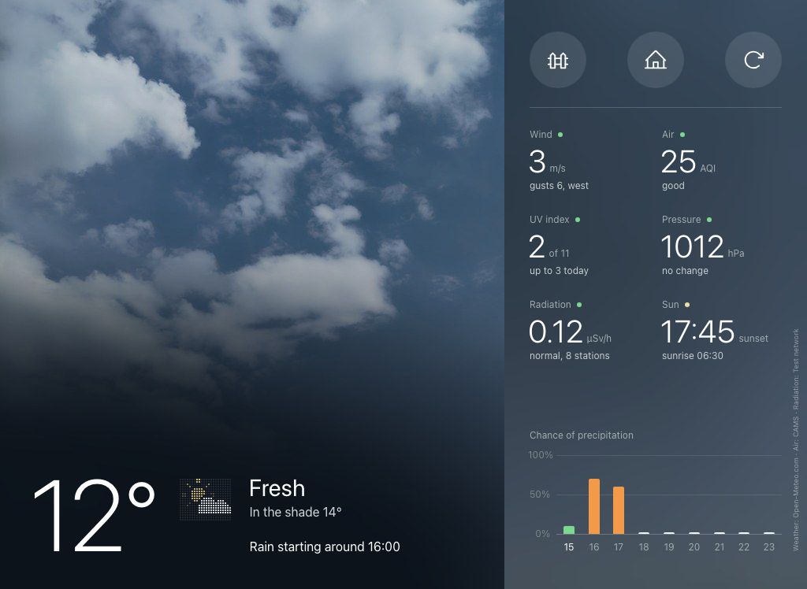
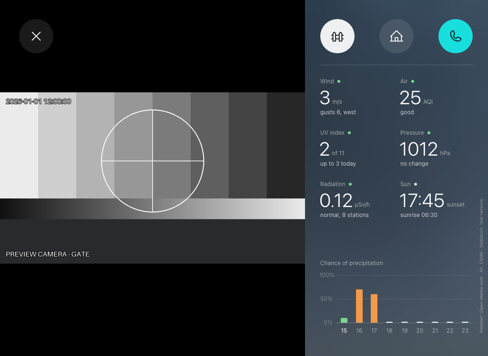
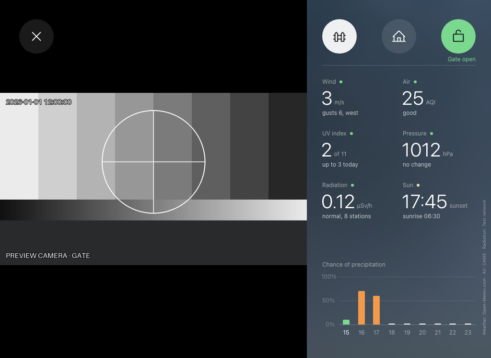
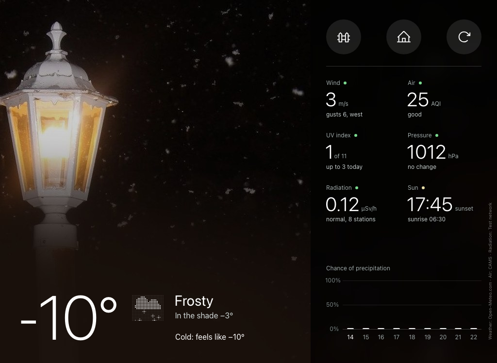
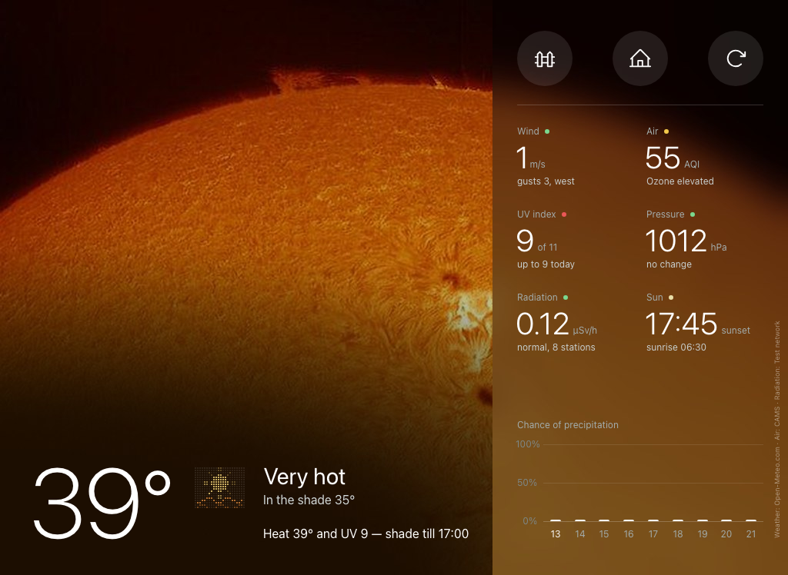
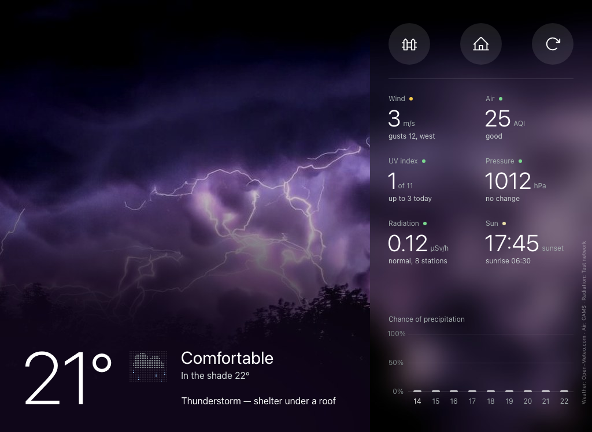
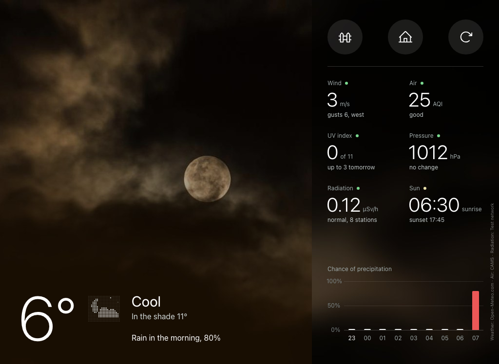

# Intercom WebTab

Intercom WebTab turns an old iPad (iOS 9 or newer) into a wall-mounted **door-intercom
station** and, when no one is at the door, a **weather, air-quality and radiation panel**
for your own address.

A small Linux server does the work: Asterisk takes the SIP call from the door panel, the
`intercom-webtab` service rings the iPad, shows the door camera and sends the
door-opening digit when you tap **Open**. The iPad only runs a web page saved to its Home
Screen. You do not need an app or an account.

| Idle: rain ending soon | Idle: rain expected at 16:00 |
|---|---|
|  |  |
| **A visitor is ringing** | **Door opened** |
|  |  |
| **Frost and snow** | **Heat** |
|  |  |
| **Thunderstorm** | **Cloudy night** |
|  |  |

*Screenshots from the preview server (`tools/preview_server.py --real-photos`): the weather
backgrounds are the real CC0 / public-domain photos the station uses, the camera picture is a
test pattern.*

## Features

**Door intercom**

- One or two door panels (for example *Gate* and *Entrance*), each with its own button.
- Rings with a loud ringtone and shows the caller's camera immediately. The station never
  answers by itself.
- **Answer** plays the visitor's voice. **Open** sends the panel's DTMF digit, and it
  answers the call first if needed, so a single tap is enough.
- You can watch a camera at any time, without a call, and open the door from that view.
  The station places a short call to the panel just to send the digit.
- Timing protection for DTMF: the digit is sent after a settle delay and then repeated,
  because many panels ignore DTMF right after the line comes up. Both delays are
  configurable for each panel.
- Safety rules: a demo call never opens a door, and Open on one panel's screen does
  nothing while the other panel is ringing. Calls are matched by SIP Call-ID, so a late
  hang-up of an old call never ends the current one.
- Video comes from the camera's RTSP stream, which is kept warm so switching is instant.
  If RTSP is not available, it comes from the SIP call.
- Four ringtones for different kinds of hearing. See
  [ringtones and hearing](docs/ringtones-and-hearing.md).

**Weather panel**

- "Feels like" temperature (UTCI) with a plain-word condition, the air temperature in the
  shade, and one of 39 animated dot-matrix icons.
- A status line that says what matters now: storms, ice, heat, rain coming or stopping,
  air quality, pressure changes, stale data.
- Six widget slots chosen from seven widgets: wind, air quality (European AQI), UV index,
  pressure, radiation (ambient gamma dose rate), sun, humidity.
- A precipitation-chance chart for this hour and the next eight.
- A background photo that matches the weather, from a catalogue of public-domain photos.
  Photos are kept in memory only.
- Units: °C or °F, m/s, km/h or mph, hPa, mmHg or inHg.
- Data from Open-Meteo (forecast and CAMS air quality) and from open radiation networks
  (Germany, Finland, the US, Canada, and Safecast worldwide), chosen automatically for
  your location.

**Operations**

- Runs as an unprivileged systemd service. One script installs it and generates the
  Asterisk configuration.
- An optional fail-closed nftables firewall for the page, SIP and RTP.
- The page updates itself when a new version is deployed. It reloads itself when it
  hangs, and it never reloads into an error page.
- Tests, an end-to-end test against a fake Asterisk, a door-panel simulator and a preview
  server for working on the page without hardware.

**Limitations**

- **Listen-only audio.** You hear the visitor, but the visitor does not hear you, because
  the page never uses the iPad's microphone.
- One or two panels. The page has a fixed landscape layout for 1024x768-point iPads.
- The interface is in English only.
- iOS does not play sound before the first touch after the page loads. After each reload,
  tap the screen once. The status line reminds you.

## How it works

```
  door panel(s)                                                    weather and radiation APIs,
  SIP + optional RTSP camera                                       photo proxy (HTTPS, outbound)
        |                                                                      |
        | SIP: through a SIP provider (variant A)                              |
        |      or registered directly to Asterisk (variant B)                  |
        v                                                                      v
  +------------------+   SIP on 127.0.0.1:5080   +-------------------------------------+
  |   Asterisk       | ------------------------> |  intercom-webtab  (Python, aiohttp) |
  |   (PJSIP)        | <------------------------ |   - tiny SIP UAS: rings, never      |
  |                  |   AMI on 127.0.0.1:5038   |     answers by itself               |
  |                  |   Originate / PlayDTMF /  |   - call / view / open logic        |
  |                  |   Hangup / channel list   |   - ffmpeg: RTSP -> MJPEG, voice -> |
  +------------------+                           |     PCM, priming video to the panel |
                                                 |   - weather, air, radiation, photos |
  RTSP camera ---------------------------------> |                                     |
                                                 +-------------------------------------+
                                                        | HTTP :8080 (token)
                                                        | page, MJPEG video, WebSocket
                                                        v
                                                 +----------------+
                                                 |  iPad, Safari  |
                                                 |  Home Screen   |
                                                 +----------------+
```

[docs/architecture.md](docs/architecture.md) describes the modules, the call flow and the
ports.

## Requirements

- **Server:** an always-on Linux machine, such as a Raspberry Pi, a mini PC or a virtual
  machine, running Debian 12, Ubuntu 22.04/24.04 or Raspberry Pi OS. You need
  Python 3.9+, `python3-aiohttp`, `python3-pil` and `ffmpeg` (with `libx264`, so that
  panels which wait for video start sending theirs). The installer sets these up.
- **Asterisk 18 or newer** with PJSIP, on the same machine. Some distributions do not
  package Asterisk; see [install.md](docs/install.md#asterisk).
- **A door panel** that either calls a number at a SIP provider or can register to your
  Asterisk, and that opens the lock on a DTMF digit. An RTSP camera is optional.
- **An iPad** with iOS 9 or newer and Safari, in landscape. It needs a network path to the
  server: the same LAN or a VPN.

## Quick start

```sh
git clone https://github.com/pavljenko/intercom-webtab.git
cd intercom-webtab
sudo ./deploy/install.sh                  # packages, user, files, token, services
sudoedit /etc/intercom-webtab/webtab.ini  # location, units, panels
sudoedit /etc/intercom-webtab/secrets.ini # AMI login, provider or door-station passwords, cameras
sudo ./deploy/install.sh                  # renders Asterisk and restarts everything
```

The installer prints the address to open on the iPad, for example
`http://192.0.2.10:8080/?k=<token>`. Open it in Safari, then choose
**Share > Add to Home Screen** and start the station from the new icon. See
[ipad-setup.md](docs/ipad-setup.md).

To try the page without any hardware:

```sh
python3 tools/preview_server.py
# open http://127.0.0.1:8897/preview?mock=rain&demo=ring in a desktop browser
```

## Documentation

| Topic | |
|---|---|
| [Architecture](docs/architecture.md) | Modules, call flow, media, ports, state |
| [Installation](docs/install.md) | `deploy/install.sh`, supported systems, upgrades, removal |
| [Configuration](docs/configuration.md) | Every key of `webtab.ini` and `secrets.ini` |
| [Asterisk](docs/asterisk.md) | SIP provider or door station, contexts, DTMF, NAT, testing |
| [iPad setup](docs/ipad-setup.md) | Home Screen, Auto-Lock, Guided Access, sound, refresh |
| [Door stations](docs/door-stations.md) | How opening works and how to tune it |
| [Weather](docs/weather.md) | Sources, scenes, "feels like", widgets, units, photos |
| [Radiation](docs/radiation.md) | Networks, automatic choice, limits |
| [Ringtones and hearing](docs/ringtones-and-hearing.md) | The four ringtones and how to choose |
| [Security](docs/security.md) | Token, network exposure, firewall, least privilege |
| [Development](docs/development.md) | Tests, preview server, leak check, page rules |
| [Troubleshooting](docs/troubleshooting.md) | Symptoms and fixes |

## License

The code is released under the [MIT License](LICENSE). The app icon
(`intercom_webtab/static/icon.svg` and its PNG renders) is licensed CC BY-SA 4.0. The
button icons come from Phosphor Icons (MIT). Weather, air-quality and radiation data, and
the background photos, come under their providers' licences, and the page shows the
required credits. See [THIRD_PARTY_NOTICES.md](THIRD_PARTY_NOTICES.md).

## Credits

- Weather data: [Open-Meteo](https://open-meteo.com/). Air quality: the Copernicus
  Atmosphere Monitoring Service (CAMS), via Open-Meteo.
- Radiation data: BfS ODL-Info (Germany), STUK via FMI open data (Finland), US EPA
  RadNet, Health Canada FPS, and [Safecast](https://safecast.org/).
- Background photos: the creators listed in `intercom_webtab/weather/photo_ids.json`,
  through [Openverse](https://openverse.org/).
- Button icons: [Phosphor Icons](https://phosphoricons.com/).
- UTCI: the operational polynomial by Bröde et al. (2012), [utci.org](http://www.utci.org/).
- Country outlines for the radiation networks: [Natural Earth](https://www.naturalearthdata.com/).
- Built on [Asterisk](https://www.asterisk.org/), [FFmpeg](https://ffmpeg.org/),
  [aiohttp](https://docs.aiohttp.org/) and [Pillow](https://python-pillow.org/).

Security reports: see [SECURITY.md](SECURITY.md). Contributions: see
[CONTRIBUTING.md](CONTRIBUTING.md).
