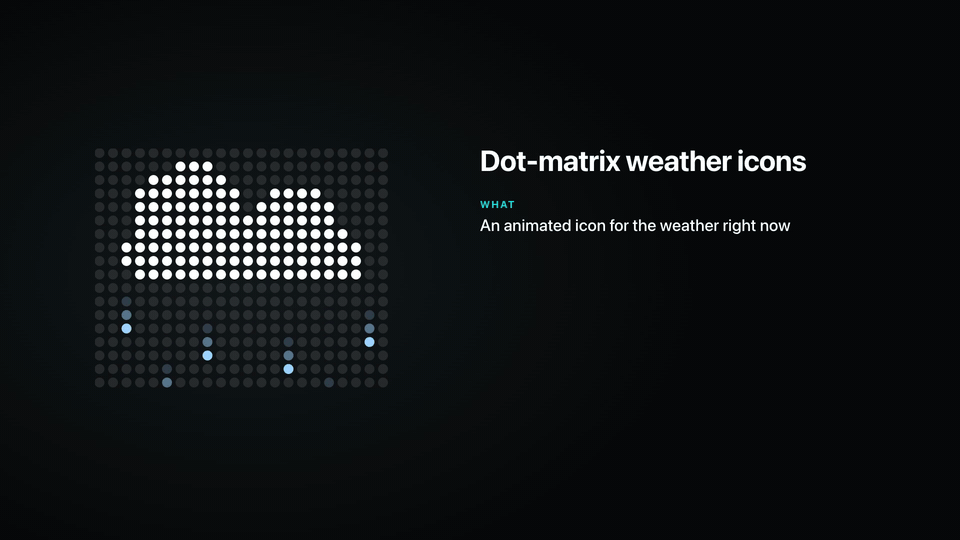

# Weather panel

When no one is at the door, the station shows the weather for `[location]`. The
left-hand side has a large "feels like" temperature, an animated icon, a condition word,
the air temperature in the shade and a status line. The right-hand side has six widgets
and a precipitation chart. The server builds everything as one JSON document
(`GET /api/panel`, version 3). The page only draws it.

The logic lives in `intercom_webtab/weather/`. `brain.py` decides what to show,
`phrases.py` holds every English text, `units.py` converts and formats numbers, and
`utci.py` computes "feels like". The brain has no network access, files or clock of its
own, and it never raises. If anything is missing, the panel still renders, with
"No data" in that place.

## Data sources

| Source | What | How often | Key |
|---|---|---|---|
| [Open-Meteo Forecast API](https://open-meteo.com/en/docs) | Current conditions, hourly values for the last 24 h and the next 25 h, daily min/max, UV maximum, sunrise and sunset for 2 days | every 10 min | none |
| [Open-Meteo Air Quality API](https://open-meteo.com/en/docs/air-quality-api) | European AQI and sub-indices, PM2.5, PM10, ozone, NO₂, dust, aerosol optical depth, from **CAMS** (`domains=auto`: the European model where available, the global one elsewhere) | every 60 min | none |
| Radiation networks | Ambient gamma dose rate, see [radiation.md](radiation.md) | every 6 h | none |

On failure, the station retries the forecast after 2, 5 and then 10 minutes, air quality
after 10 minutes and radiation after 30 minutes. The last good data are kept in
`/var/lib/intercom-webtab/weather_state.json`, so a restart shows a panel immediately.

Open-Meteo's free API is meant for **non-commercial use**, and its data are licensed
**CC BY 4.0**. CAMS data are provided under the Copernicus licence. For credits and terms,
see [THIRD_PARTY_NOTICES.md](../THIRD_PARTY_NOTICES.md). The station sends these services
only the coordinates and time zone from `[location]`. Two decimals are enough.

**Freshness.** When a source stops updating, the status line says so honestly, for
example "Weather not updated for 2 h":

| Source | Stale after | Treated as dead after |
|---|---|---|
| Forecast | 45 min | 3 h (then the icon shows "No data") |
| Air quality | 3 h | 12 h |
| Radiation | 18 h, or the newest reading is older than 48 h | 48 h |

The precipitation chart turns grey when the forecast is more than 2 hours old.

## "Feels like" (UTCI)

The big number is the **Universal Thermal Climate Index**. It is the temperature of a
reference environment that would put the same strain on the body as the real one,
taking wind, humidity and sunshine into account. The station uses the operational
polynomial of Bröde et al. (2012) with these inputs:

- air temperature and relative humidity (2 m);
- wind speed at 10 m, clamped to 0.5–17 m/s, the valid range of the polynomial;
- mean radiant temperature, approximated as
  `Tmrt = air temperature + min(0.022 × shortwave radiation [W/m²], 18 °C)`. In the
  shade and at night it equals the air temperature. In full sun it is up to 18 °C
  higher.

The **condition word** comes from the UTCI assessment scale, refined by the data:

| UTCI (°C) | Stress category | Word | Refinements |
|---|---|---|---|
| above 46 | extreme heat stress | Extreme heat | |
| 38 to 46 | very strong heat stress | Very hot | |
| 32 to 38 | strong heat stress | Hot | |
| 26 to 32 | moderate heat stress | Warm | humidity ≥ 60 %: "Hot and humid", or "Muggy" if wind < 2 m/s; humidity ≤ 30 %: "Hot and dry" |
| 9 to 26 | no thermal stress | Comfortable | below UTCI 15: "Fresh", or "Damp" in fog or drizzle |
| 0 to 9 | slight cold stress | Cool | "Raw" (0–7 °C, humidity ≥ 85 %, wind ≥ 4 m/s); "Damp" in fog or drizzle above 0 °C |
| −13 to 0 | moderate cold stress | Cold | "Frosty" when the air is at or below 0 °C; otherwise "Raw" as above |
| −27 to −13 | strong cold stress | Very cold | "Hard frost" when the air is at or below 0 °C |
| −40 to −27 | very strong cold stress | Bitter cold | "Severe frost" when the air is at or below 0 °C |
| below −40 | extreme cold stress | Extreme frost | |

Under the word, "In the shade 12°" is the plain air temperature. Without the data
needed for UTCI, the word falls back to the title of the current scene, for example
"Rain".

## Scenes and icons

Each moment maps to one of **39 scenes**, drawn as animated dot-matrix icons on a 22x18
grid (`static/dots.js`). Each icon is built from simple shapes (circles and line segments)
that are tested at the dot centres, and a new frame is drawn every 150 ms. On a non-Retina
iPad every dot lands exactly on 2x2 pixels, so the icons stay sharp, and they need no
image files.

The order of the checks is the priority, so dangerous and more specific conditions win:

1. **Thunderstorms:** with hail, severe (gusts from 20 m/s), ordinary.
2. **Freezing precipitation:** freezing rain, freezing drizzle. This includes liquid
   precipitation at or below 0 °C.
3. **Sleet:** rain and snow together, or a snow code above +0.5 °C with liquid
   precipitation.
4. **Snow:** blizzard (gusts from 15 m/s), heavy snow (by code, rate or visibility under
   400 m), snow grains, snow showers with clear spells, snow.
5. **Rain:** heavy rain (by code, from 10 mm/h, or 15 mm in 12 h), showers with clear
   spells, drizzle, rain.
6. **No precipitation, but a hazard in the air or underfoot:** dust storm, black ice (it
   was wet, now it is at or below 0 °C), drifting snow, strong wind, fog and freezing fog
   (visibility under 1 km), dust haze, smoke (only with clear evidence: high PM2.5, low
   dust, mostly fine particles), severe frost, heat, hot dry wind, haze.
7. **Cloud cover,** day or night: clear, mostly clear, partly cloudy, mostly cloudy,
   overcast.

The 39 names are `clear-day`, `clear-night`, `mostly-clear-day`, `mostly-clear-night`,
`partly-cloudy-day`, `partly-cloudy-night`, `mostly-cloudy-day`, `mostly-cloudy-night`,
`overcast`, `fog`, `rime-fog`, `drizzle`, `rain`, `heavy-rain`, `freezing-drizzle`,
`freezing-rain`, `showers-day`, `showers-night`, `sleet`, `snow`, `heavy-snow`,
`snow-grains`, `snow-showers-day`, `snow-showers-night`, `thunderstorm`,
`thunderstorm-heavy`, `thunderstorm-hail`, `wind`, `blizzard`, `drifting-snow`,
`dust-haze`, `dust-storm`, `smoke`, `dry-wind`, `haze`, `heat`, `frost`, `ice` and
`not-available`. Thresholds follow WMO-No. 8 and common synoptic practice. The comments
in `SC` in `brain.py` give the source of each one.

The icon animates only while idle, and stops while video is on screen.

## Status line

Under the condition word, the status line shows up to three short messages (40
characters each), the most important first. It rotates every 8 seconds when more than
one message matters. Priorities, from highest:

0. **Critical:** dangerous radiation, storm-force gusts, hazardous air, freezing rain,
   hail, torrential rain, dangerous heat or cold, extreme UV.
1. **Data problems:** a source not updated, a camera silent.
2. **Adverse conditions:** strong wind, poor air, dust, ozone, a pressure jump, high UV,
   heat or cold stress, black ice, dense fog, thunderstorm.
3. **Precipitation:** starting or stopping, "Rain until ~18:00, then dry", the chance of
   rain later today.
4. **Moderate conditions** and combinations.
5. **Calm:** a quiet summary when nothing else matters.

The first line is held for at least 10 minutes, unless something more urgent appears.
Each message keeps its wording for a 2-hour window (3 hours for calm summaries), and a
calm summary is not repeated within a day. The page adds
its own facts on top, such as "Sound is off — tap the screen" or "No connection to the
server — pull down".

## Widgets

Six slots, in the order of `[ui] widgets`. Each widget shows a name with a coloured
**level dot**, a value with a unit, and a short note:

| Dot | Level |
|---|---|
| green | 0, normal |
| yellow | 1 |
| orange | 2 |
| red | 3 |
| purple | 4, extreme |
| grey | no data |
| pale yellow | the sun widget, which has no level |

| Key | Value | Note | Level from |
|---|---|---|---|
| `wind` | mean speed | gusts and direction ("gusts 17, north-west"), or the forecast gusts if they set the level | mean 6 / 10 / 15 / 20 m/s, gusts 10 / 15 / 20 / 25 m/s, now and over the next 3 hours |
| `air` | European AQI | the pollutant that drives the level ("NO₂ above the limit"), or a word ("clean") | AQI 40 / 60 / 80 / 100, and PM2.5, PM10, O₃, NO₂ limits |
| `uv` | UV index | today's peak, or tomorrow's after sunset | WHO scale: 3, 6, 8, 11 |
| `pressure` | surface pressure | change over 24 h | deviation from the normal for your elevation, and fast changes over 3 h and 24 h |
| `radiation` | dose rate in µSv/h | "normal, 8 stations", or how a raised value is confirmed | 0.20 / 0.30 / 0.60 / 1.0 µSv/h, confirmed by two stations or two days |
| `sun` | the next sunrise or sunset | the other event of that day | (none) |
| `humidity` | relative humidity in % | dew point | dew point 18 / 21 / 24 °C |

Levels use hysteresis, so a value that hovers at a threshold does not make the dot
flicker. When a source is stale, the value is replaced by a dash and the note says when
the data were last read ("as of 12:30", "as of 6 Oct"). One exception: a level of 2 or
higher keeps its value on stale data, so a dangerous reading does not disappear. Data
that are dead always show the dash.
With `[radiation] provider = none`, the radiation slot goes to the first widget not
already on the list.

## Precipitation chart

Nine bars: this hour and the next eight. Each bar is the probability of precipitation,
on a 0 / 50 / 100 % scale. Colours: white below 5 %, then green, yellow, orange and red
in steps of 25 %. Hours are local hours from `[location] timezone`.

## Units

| Setting | Options | Shown as |
|---|---|---|
| `temperature` | `C`, `F` | `12°`, `−9°` |
| `wind` | `m/s`, `km/h`, `mph` | whole numbers |
| `pressure` | `hPa`, `mmHg`, `inHg` | `1013`, `760`, `29.92`; changes as `+7`, `−4`, `+0.21` |

Shared formatting rules:

- Numbers round half away from zero.
- Negative numbers use the real minus sign (U+2212).
- Large temperatures never carry a `+` and never show `−0`.
- Dose rates have two decimals below 10 µSv/h.
- Visibility in fog messages is in metres, or in feet with `wind = mph`.

Internally, every decision is made in °C, m/s and mmHg, so the thresholds are the same
in every unit system.

## Photos

The left side shows a weather photo, and the right panel is the same photo blurred and
darkened.

- **Catalogue:** `intercom_webtab/weather/photo_ids.json` has 91 photos in 18 groups,
  such as clear sky, rain, fog, snow, storm, frost, haze, smoke and wind. All are **CC0
  or Public Domain Mark**, so no credit line is required. Creators and licences are kept
  in the file anyway.
- **Choice:** the group follows the scene, day or night, and the season. Below 3 °C the
  station uses a winter variant, with 1 °C of hysteresis. With no temperature known, it
  goes by month, and the latitude decides the hemisphere. Within a group, the photo is
  stable for a whole local day.
- **Download:** the station uses the Openverse API's image proxy
  (`api.openverse.org`), with a 20 s socket timeout, 30 s per photo and at most 60 s of
  downloading per round. It also fetches the photos for the scenes expected in the next
  three hours.
- **Memory only:** each photo is processed into a 1024x748 frame with a darkening
  gradient from the bottom-left corner, and a blurred panel. At most six are kept in
  memory, and nothing is written to disk. A photo that fails is skipped for 30 minutes.
  Until the new photo is ready, the previous one stays on screen.
- With `[weather] photos = off`, the background is a plain tone.

`tools/photo_sheet.py OUT_DIR` downloads the whole catalogue and renders contact sheets
for review. It uses the network.

## Attribution

A small vertical line at the right edge credits the data:
`Weather: Open-Meteo.com · Air: CAMS · Radiation: <network>`. The data licences require
this credit. If you set `[weather] attribution = off`, give the credits somewhere else
where viewers of the panel can see them.

## Turning it off

- `[weather] enabled = off`: no requests to weather, air-quality, radiation or photo
  services. The panel shows "No data".
- `[radiation] provider = none`: no radiation requests, and the widget slot is reused.
- `[weather] photos = off`: no photo downloads.
